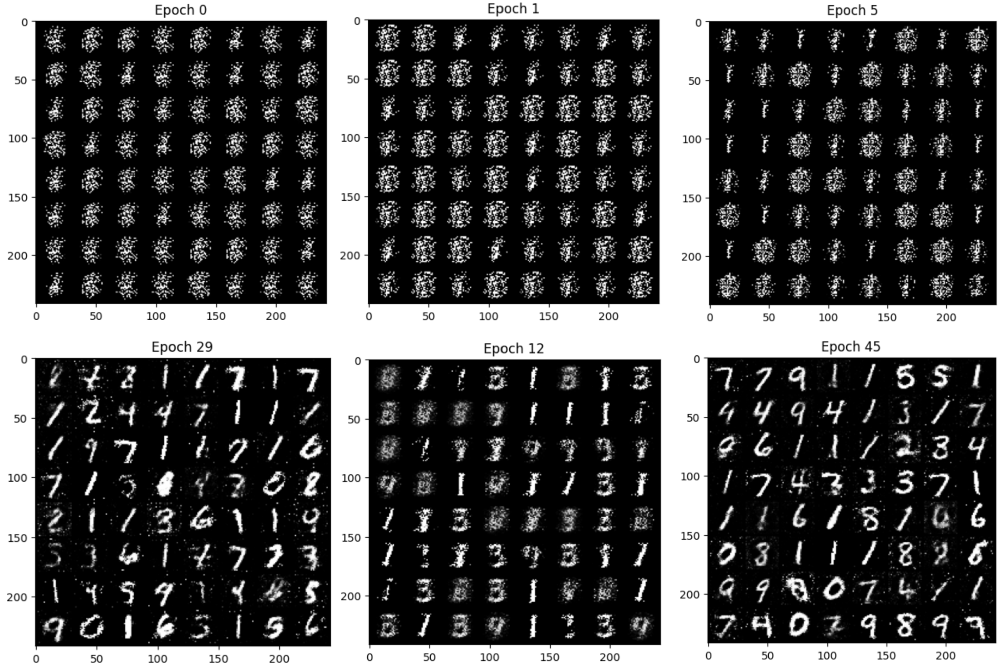
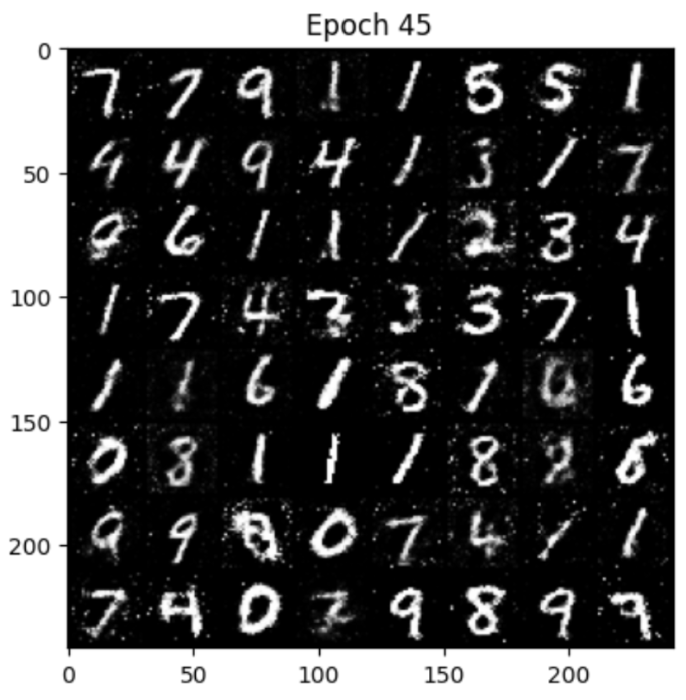

  # PoC ComputerVision Models
## Neural Style Transfer
Neural Style Transfer is a deep learning technique that applies the style of an image to the content of another (e.g. in this repo, Monet's painting style to a picture of some lilypads). Style Transfer outputs can be viewed under the 'Demo Outputs' section.
### Model Architecture
VGG-19 was used as a feature extractor, pretrained on IMAGENET.

### Loss Objective
The loss consists of 3 components: Content Loss, Style Loss, and Total Variation Loss.

```math
L = \alpha L_{\text{content}} + \beta L_{\text{style}} + \lambda_{\text{tv}} L_{\text{tv}}
```
where
- $\alpha$, $\beta$, and $\lambda_{tv}$ are scaling factors for each loss component

#### Content Loss $L_{\text{content}}$
Deeper layers in the CNN are used to compute content loss because deeper layers usually contain semantic features (high number of channels, small feature maps) that provide the high-level structure of the image content. The content loss measures the MSE between feature representations of an image at a layer $l$.

```math
L_{\text{content}}(\tilde{p}, \tilde{x}, l) = \frac{1}{2} \sum_{i,j} \left( F^l_{ij} - P^l_{ij} \right)^2
```

where:
- $F^l_{ij}$ represents the feature map of the generated image at layer $l$.
- $P^l_{ij}$ represents the feature map of the target image at the same layer.
- The sum is taken over all spatial locations $(i, j)$ in the feature map.

#### Style Loss $L_{\text{style}}$
Earlier layers in the CNN are used to compute style loss because they usually capture local patterns, rather than high-level semantic features. Local patterns involve image characteristics like colour distributions, edges, and textures, making them great for extracting style features from.

We use multiple layers for style because different layers at different depths capture different levels of textures and spatial patterns. An important point to note is that the Gram matrices of the feature maps are used in calculating style loss. This is because the Gram matrix gives us the correlations between different feature maps within the same CNN layer. The Gram matrix of a CNN feature map from layer $l$ is

```math
G^l_{ij} = \sum_k F^l_{ik} F^l_{jk}
```

where
- $G^l_{ij}$ is the inner product between the vectorised feature maps $i$ and $j$ in layer $l$

The style loss contributed by a single layer is defined as

```math
E_l = \frac{1}{4 N_l^2 M_l^2} \sum_{i,j} \left( G^l_{ij} - A^l_{ij} \right)^2
```

where 
- $N_l$ is the number of feature maps of size $M_l$ for layer $l$
- $\frac{1}{4 N_l^2 M_l^2}$ is a normalisation constant to ensure that the feature map's contribution is invariant to scale

Hence, the total style loss is defined as

```math
L_{style}(\tilde{a}, \tilde{x})\sum^L_{l=0}w_lE_l
```
where $w_l$ are tunable weighting factors for each layer's contribution

#### Total Variation Loss $L_{\text{tv}}$
I chose to include TV loss to reduce the noise in the output image. 

```math    
L_{\text{tv}} = \sum_{i,j}  |x_{i,j} - x_{i+1,j}| + |x_{i,j} - x_{i,j+1}|
```

### Hyperparameters
Learning Rate: 0.01, Optimiser: Adam, No. Iterations: 1500

$\alpha$: 1e3, $\beta$: 5e6, $\lambda_{tv}$: 1e-6

### Training Procedure Summary
1) Instantiate the model and attach hooks at intermediate layers to capture activation maps for computing Content and Style Loss
2) Forward pass the image through the model. Ensure that gradient tracking is enabled for the image tensor. The generated image is initialised by cloning the original input.
3) Compute the loss (defined earlier) and backpropagate.
4) After training, denormalise the images and permute tensor dimensions for viewing with MatPlotLib.

### Demo Outputs
I'm actually happy with these wahahahaha


## CLIP

## GAN
GANs generate realistic images by learning to model the distribution of images in a training dataset. Briefly, a GAN consists of a generator which learns the data distribution of an image dataset and a
discriminator which learns to predict probabilities of samples coming from the training dataset or from G.

While learning the generator's distribution $p_g$, the generator learns to map input noise variable $p_z(z)$ to the data space using the generator's mapping function 
$G(z;\theta_g)$. $\theta_g$ represents the generator's parameters. The discriminator's function is given by $D(x;\theta_d)$ that outputs a scalar. $D(x)$ represents the probability that a sample $x$ came from
the training data instead of $G$. $D$ is trained to maximise the probability of assigning the correct labels to all samples. Simultaneously, $G$ is trained to minimise $log(1-D(G(z)))$.

### Loss Objective
The authors framed the optimisation objective as a two-player minimax game with value function $V(G,D)$

```math
\min_G \max_D V(D, G) = \mathbb{E}_{x \sim p_{\text{data}}(x)} [\log D(x)] + \mathbb{E}_{z \sim p_z(z)} [\log(1 - D(G(z)))]
```
where
- $D(x)$ represents the discriminator's estimate of the probability of $x$ belonging to the training set
- $G(z)$ is the generator's mapping of a latent noise $z$ to the data space
- $p_{\text{data}}(x)$ is the true distribution of real data
- $p_z(z)$ is the prior distribution of the input noise

### Hyperparameters
Img shape: $(1 \times 28 \times 28)$, Latent dim: 64

Disc. channels: [784, 512, 256, 128, 32, 1]

Gen. channels: [64, 128, 256, 512, 784]

Batch size: 64, Lr: 0.002, Epochs: 50

### Training Procedure Summary
In practice, the discriminator and generator are trained iteratively. D cannot be immediately optimised to completion, because it would cause overfitting. Also, if $D$ performs too well initially, it will
be difficult for $G$ to learn effectively due to small gradients. For instance, if $D$ is a perfect classifier (assigns 1 for real, 0 for fake), then $log(1−D(G(z)))≈log(1−0)=log1=0$. To improve gradients for $G$, instead of training $G$ to minimise $log(1 − D(G(z)))$, we train it to maximise $log D(G(z))$. 

In my implementation, I also train the discriminator and generator iteratively.
Repeat per epoch:
1. **Train $D$**  
   - Sample a batch of real images and label them as $1$
   - Generate a batch of fake images with $G$ and label them as $0$
   - Compute $D$'s loss, backprop, and update $D$

2. **Train $G$**
   - Generate a batch of fake images from noise, label them as $1$ (real) because we want to maximise $log D(G(z))$
   - Compute $G$'s loss, backprop and update $G$

## Demo Outputs
These images are taken at some time points throughout the training process



## StyleGAN
StyleGAN is an extension of GAN. It's novelty lies in the new architecture the authors proposed for the generator:
1. Non-linear Mapping Network $f:Z \rightarrow W$ which maps a latent code $z$ in the input space to $w \in W$ with the same dimensions. The main purpose of the Mapping Network is to disentangle latent features, meaning that attributes of the latent space (e.g. hair feature, glasses features) are more cleanly separated so that each feature can be independently tuned.
2. Then, through "A" (in diagram), which are learned affine transformations (implemented as single linear layers), $w$ is transformed into parameters $y=(y_s, y_b)$,  used by Adaptive Instance Normalisation (AdaIN) layers to control the strength of features at each layer. AdaIN layers are applied to CNN feature maps after CNN layers (see original diagram from paper).
```math
AdaIN(x_i, y) = y_{s,i}\frac{x_i − \mu(x_i)}{\sigma(x_i)}+y_{b,i}
```
