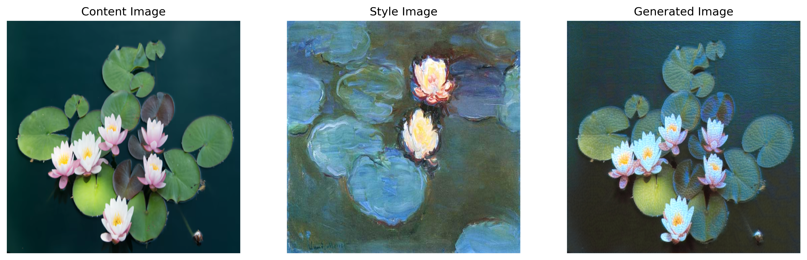

# PoC ComputerVision Models
## Neural Style Transfer
### Model Architecture
VGG-19 was used as a feature extractor, with pretrained weights from PyTorch.

### Loss Objective
The loss consists of 3 components: Content Loss, Style Loss, and Total Variation Loss.
More formally defined as:

### Hyperparameters
Learning Rate: 0.01
Optimiser: Adam
No. Iteratios: 1500
alpha, beta, tv_lambda = 1e3, 5e6, 1e-6

### Training Procedure Summary
1) Instantiate the model and attach hooks at intermediate layers to capture activation maps for computing Content and Style Loss
2) Forward pass the image through the model. Ensure that gradient tracking is enabled for the image tensor. The generated image is initialised by cloning the original input.
3) 

## Demo Outputs
A description of the procedure and training hyperparameters can be found below this section

## CLIP

## GAN

## StyleGAN
