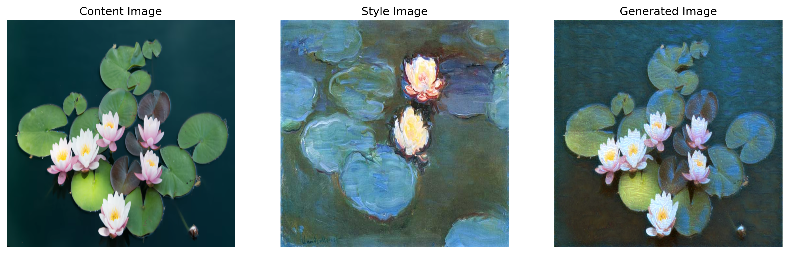

# PoC ComputerVision Models
## Neural Style Transfer
### Model Architecture
VGG-19 was used as a feature extractor, with pretrained weights from PyTorch.

### Loss Objective
The loss consists of 3 components: Content Loss, Style Loss, and Total Variation Loss.
More formally defined as:

### Hyperparameters

## CLIP

## GAN

## StyleGAN
